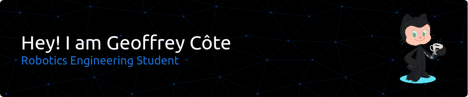

I'm a robotic graduate student in a double degree between Centrale Nantes (FR) and DTU (DK).

<picture>
  <source media="(prefers-color-scheme: dark)" srcset="https://github-profile-summary-cards.vercel.app/api/cards/profile-details?username=meltwin&theme=nord_dark">
  <source media="(prefers-color-scheme: light)" srcset="https://github-profile-summary-cards.vercel.app/api/cards/profile-details?username=meltwin">
  
</picture>

## Skills

  
|                                                                                                                                                                                                                                                                                                     School / Work project                                                                                                                                                                                                                                                                                                     |                                                                                                                                                                                                                                                                                                                                           Personal projects                                                                                                                                                                                                                                                                                                                                            |
| :---------------------------------------------------------------------------------------------------------------------------------------------------------------------------------------------------------------------------------------------------------------------------------------------------------------------------------------------------------------------------------------------------------------------------------------------------------------------------------------------------------------------------------------------------------------------------------------------------------------------------: | :----------------------------------------------------------------------------------------------------------------------------------------------------------------------------------------------------------------------------------------------------------------------------------------------------------------------------------------------------------------------------------------------------------------------------------------------------------------------------------------------------------------------------------------------------------------------------------------------------------------------------------------------------------------------------------------------------: |
|      |   |
|   |                                                                                                                                                                                                                                                                            |
|                                                                                                           |                                                                                              |
|                                                                                                                                                                                                                                                                                                                                                                                                             |                                                                                                                                                                                                                                                                                                                                                                                                                                                                                                                                                                                                                                                                                                        |

## Robotics

All of my robotics-related projects are hosted on the [Baxterminator](https://github.com/Baxterminator) organisation. Here are some core projects of mine:

## Minecraft

I also make some projects around the game Minecraft, especially with the Vitteria's team I'm in. You can found most of my Minecraft-related works on the [Ayrking](https://github.com/Ayrking) organisation !

<table style="text-align:center;width=100%">
  <tr>
    <td>
      
    </td>
    <td>
      
    </td>
  </tr>
  <tr>
    <td>

    </td>
    <td></td>
  </tr>
</table>